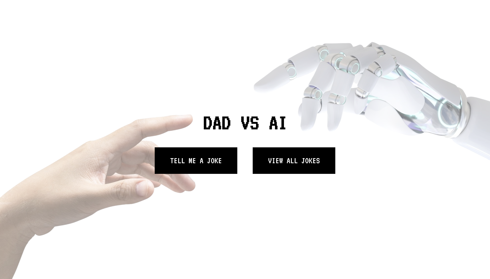

# Dad vs AI - A Joke Guessing Game 🎮



Welcome to Dad vs AI! This interactive web game challenges players to distinguish between Dad jokes and AI-generated jokes. Built with Vue.js and a Lumen backend API, this project showcases modern web development practices and interactive user experiences.

## Table of Contents 📋
1. [Features](#features)
2. [Skills](#skills)
3. [Installation](#installation)
4. [Usage](#usage)
5. [License](#license)

## Features ✨ <a name="features"></a>

- **Joke Guessing Game** 🎲 - Test your ability to distinguish between Dad and AI jokes
- **Interactive UI** 🖥️ - Smooth animations and transitions using GSAP
- **Joke Collection** 📚 - Browse through all jokes and their sources
- **Add New Jokes** ✍️ - Contribute your own Dad or AI-generated jokes

## Skills 🛠️ <a name="skills"></a>

Here's what you'll find showcased in this project:

- **Frontend**: 
  - Vue.js
  - HTML5
  - CSS3/SASS
  - JavaScript (ES6+)
  - AJAX/Fetch API
  - GSAP

- **Backend**:
  - PHP
  - Lumen Framework
  - RESTful API Design
  - MySQL Database

## Installation 📦 <a name="installation"></a>

To run this project locally:

1. Clone the repository into your WAMP/MAMP directory
2. Navigate to the backend directory and run:

   ```
   composer install
   ```
3. Import the database:
   - Find the SQL file in `backend/database/jokes.sql`
   - Import it using phpMyAdmin in your WAMP/MAMP installation
4. Access the project through your local server (e.g., http://localhost/Bilyea_Isaac_Vue_AJAX/frontend)

## Usage ⚙️ <a name="usage"></a>

1. Click "TELL ME A JOKE" to start the game
2. Read the displayed joke
3. Guess whether it's a Dad joke or AI-generated joke
4. Get immediate feedback on your guess
5. Click "Next Joke" to continue playing
6. Use "VIEW ALL JOKES" to browse the complete collection
7. Add your own jokes through the Add Joke form

## License 📄 <a name="license"></a>
This project is licensed under the MIT License. For more details, refer to the [LICENSE](LICENSE) file in the repository.